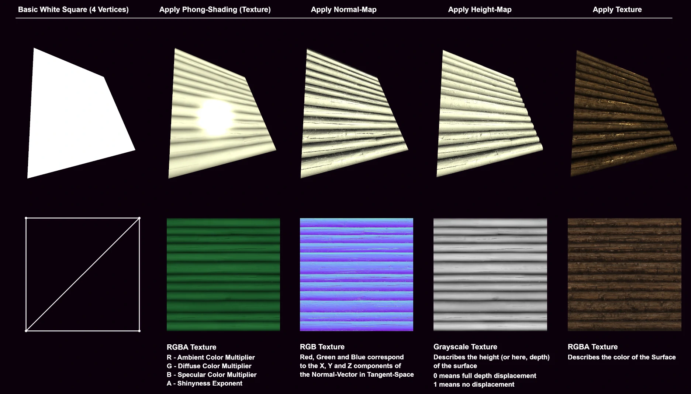
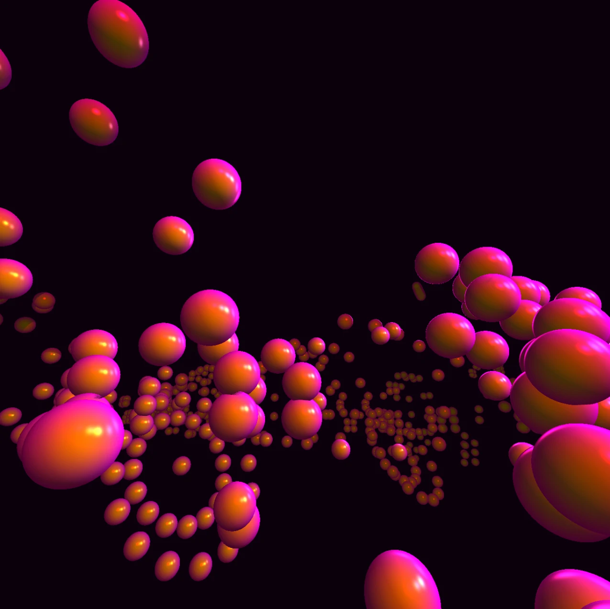
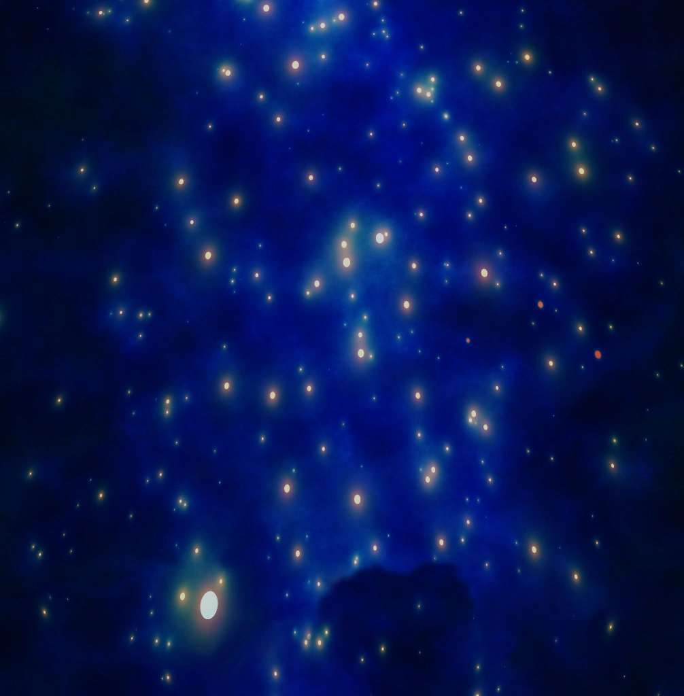

The result of a 'Game Engine Project' course I took in university.  
After the course, I rewrote the [C++ project](https://github.com/BlazingTwist/GameEngineProject) in Java.

Has basic phong shading and support for normal- and height maps.

 

A simple shader for Sphere particles.

 

It also generated this image.

 

## How to Use

To explore the current state of the engine, simply execute the [Main class](src/main/java/main/Main.java).  
The console will provide you with a list of demos to try.  
You can enter these by pressing the corresponding number key while inside the engine's window.

Here's a list of the current demos:  
[1] Spring 'Physics'  
[2] Free Fall Physics  
[3] Orbits  
[4] Parallax Occlusion  
[5] Lighting  
[6] Perlin Noise  
[7] Marching Cubes  
[8] Collision Detection  
[9] Space-Sim